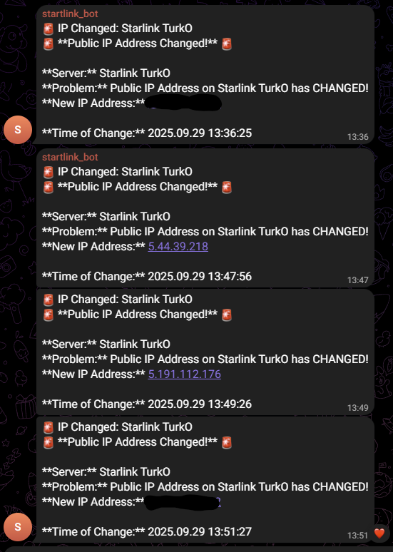

# Zabbix Template: Dynamic Public IP Monitoring via Telegram

This repository provides a pre-built Zabbix 7.x template (`Public IP Monitoring.yaml`) and a step-by-step guide to automatically monitor server public IP address changes and receive instant Telegram notifications.

The primary advantage of this solution is its template-based approach. You can import the provided template, follow a few simple configuration steps, and then apply this monitoring to dozens or even hundreds of hosts or entire host groups with ease. This method is ideal for environments with dynamic IPs, such as Starlink or failover internet connections.

### Final Notification Format Example:


---

## ✅ Prerequisites

Before importing the template into Zabbix, you need to prepare two things:

**1. Agent-Side Configuration (On the Monitored Server)**
The Zabbix agent on the host you want to monitor must be "taught" how to find its own public IP. Run the following commands on the target server's terminal:

* **Create the Custom Parameter (UserParameter):**
    ```bash
    echo 'UserParameter=public.ip,curl -s ifconfig.me' | sudo tee /etc/zabbix/zabbix_agent2.d/public_ip.conf
    ```

* **Restart the Agent:**
    ```bash
    sudo systemctl restart zabbix-agent2
    ```

* **Verify the Configuration:**
    Test that the key is working correctly. This command should return the server's public IP.
    ```bash
    zabbix_agent2 -t public.ip
    ```

**2. Telegram Bot Information**
You will need the following information from Telegram:
* A **Bot Token** from `@BotFather`.
* Your personal or group **Chat ID** from `@userinfobot`.

---

## 🛠️ Zabbix Server Installation & Configuration Guide

### Step 1: Download and Import the Zabbix Template
This is the core of the solution. First, we will download the template file directly to the Zabbix server and then import it.

1.  Log in to your **Zabbix server's command-line interface (terminal)**.
2.  Download the template file from this repository using the following command:
    ```bash
    curl -o "Public IP Monitoring.yaml" "[https://raw.githubusercontent.com/DualStackAdmin/Monitoring-Dynamic-Public-IP-Addresses-with-Zabbix-and-Telegram-Notifications/main/Public%20IP%20Monitoring.yaml](https://raw.githubusercontent.com/DualStackAdmin/Monitoring-Dynamic-Public-IP-Addresses-with-Zabbix-and-Telegram-Notifications/main/Public%20IP%20Monitoring.yaml)"
    ```
3.  Now, in your **Zabbix frontend**, navigate to `Data collection` -> `Templates`.
4.  Click the **`Import`** button in the top-right corner.
5.  Click **"Choose file"** and select the `Public IP Monitoring.yaml` file you just downloaded.
6.  Complete the import by clicking the **`Import`** button.

> **What's inside the template?**
> * **Item (`Public IP Address`):** Collects the public IP every 5 minutes.
> * **Trigger (`Public IP Address on {HOST.NAME} has CHANGED!`):** Fires when the IP address value changes. It is configured in **`Multiple`** event generation mode to ensure a notification is sent for *every* change.

### Step 2: Configure the Telegram Media Type
Ensure your Zabbix `Telegram` media type is configured correctly to send notifications.

1.  Navigate to `Alerts` -> `Media types` and select `Telegram`.
2.  In the `Parameters` tab, ensure you have the following 8 parameters configured:
    * `alert_message`:
        ```html
        <b>{EVENT.SEVERITY}</b>: {EVENT.NAME}<b>Host</b>: {HOST.NAME}<b>Time</b>: {EVENT.TIME} on {EVENT.DATE}<pre>{ITEM.NAME}: {ITEM.VALUE}{TRIGGER.URL}</pre>
        ```
    * `alert_subject`: `{EVENT.STATUS}: {EVENT.NAME} on {HOST.NAME}`
    * `api_chat_id`: Your **Chat ID**.
    * `api_parse_mode`: `HTML`
    * `api_token`: Your **Bot Token**.
    * `event_nseverity`: `{EVENT.NSEVERITY}`
    * `event_update_status`: `{EVENT.UPDATE.STATUS}`
    * `event_value`: `{EVENT.VALUE}`
3.  Navigate to `Alerts` -> `Users` and add the Telegram media to your user profile.

### Step 3: Create the Notification Action
This Action connects the trigger from our template to your Telegram media type.

1.  Navigate to `Alerts` -> `Actions` -> `Trigger actions` and create a new Action.
2.  **Conditions Tab:** Create a universal condition that works for any host using the template:
    * **Type:** `Event name`
    * **Operator:** `contains`
    * **Value:** `Public IP Address has CHANGED!`
3.  **Operations Tab:** Define the custom messages for your alerts.
    * **Problem Message:**
        ```html
        🚨 <b>Public IP Address Changed!</b> 🚨<b>Server:</b> {HOST.NAME}<b>Problem:</b> {TRIGGER.NAME}<b>New IP Address:</b> {ITEM.LASTVALUE1}<b>Time of Change:</b> {EVENT.DATE} {EVENT.TIME}
        ```
    * **Recovery Message:**
        ```html
        ✅ <b>Resolved: Public IP Address is Stable</b><b>Server:</b> {HOST.NAME}<b>Problem:</b> {TRIGGER.NAME}<b>Time of Recovery:</b> {EVENT.RECOVERY.DATE} {EVENT.RECOVERY.TIME}
        ```

### Step 4: Link the Template to Your Hosts
This is the final step where you activate the monitoring.

1.  Navigate to `Data collection` -> `Hosts` and select the host (or multiple hosts) you want to monitor.
2.  Go to the `Templates` tab.
3.  In the "Link new templates" field, find and add the **`Public IP Monitoring`** template.
4.  Click the **`Update`** button.

As you rightly pointed out, the great advantage here is that you can also link this template to **entire host groups** to enable this monitoring for many servers at once.

**Setup is complete!** Any host or host group linked to this template will now automatically report public IP changes.
